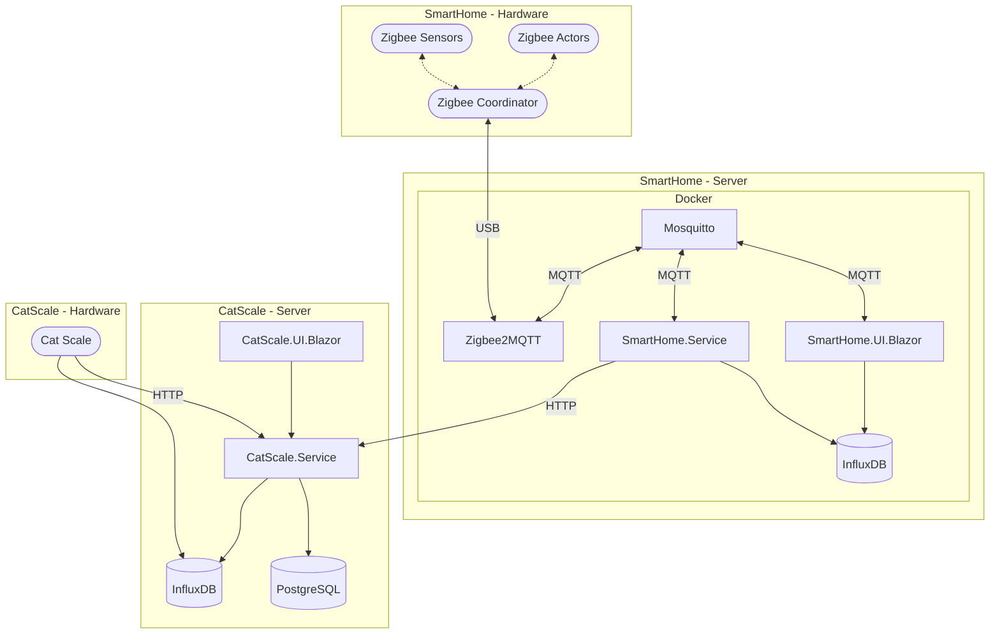

# smart-home

Simple home-automation solution for my personal needs.

# Components

- Mosquitto: MQTT Broker
- Zigbee2MQTT: Exposes zigbee devices via MQTT
- SmartHome.Service: Dotnet service which implements the required logic
- Smarthome.UI.Blazor: Simple frontend